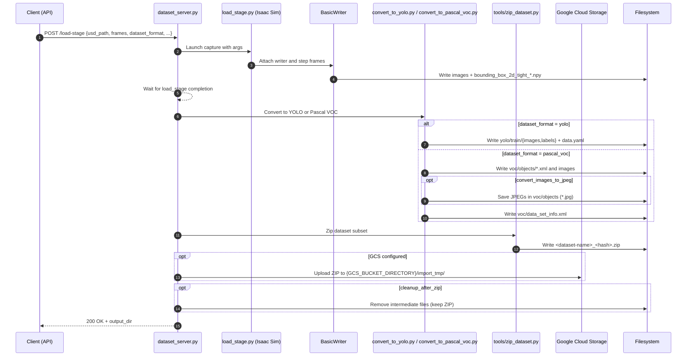

# isaacsimapp

A Python toolkit built on top of [NVIDIA Isaac Sim](https://developer.nvidia.com/isaac-sim) and Omni Replicator for generating synthetic computer vision datasets. It loads a USD stage, captures RGB frames and bounding boxes, applies a configurable pipeline of image augmentations, exports to **YOLO** or **Pascal VOC**, zips the result with a content-based hash, and optionally uploads to Google Cloud Storage with a webhook callback.

It can be used either as a CLI ([scripts/load_stage.py](scripts/load_stage.py)) or as a FastAPI REST server ([scripts/dataset_server.py](scripts/dataset_server.py)). Only one `/load-stage` job runs at a time; concurrent requests receive HTTP 409 until the current run finishes.

## Features

- USD stage loading with configurable camera (position, rotation, focal length, motion path).
- Optional procedural cube spawning for quick smoke tests.
- 20 augmentations with per-augmentor `frequency` (capture every Nth frame): brightness, contrast, motion blur, glass blur, pixellate, rotate, crop & resize, CutMix, Sobel, Canny, conv2d, random conv, shot noise, speckle noise, RGB↔HSV, colorize depth, colorize normals, sigmoid adjust, image blend.
- Bounding box export via Replicator `BasicWriter` with automatic conversion to **YOLO** (`train/images`, `train/labels`, `data.yaml`) or **Pascal VOC** (images + per-image XML + `data_set_info.xml`).
- Optional PNG→JPEG conversion of captured frames.
- Content-hash zipping, optional GCS upload, optional webhook callback keyed by `hash_request`.
- FastAPI REST server with single-job locking.

## Repository layout

```
replicant/
├── scripts/
│   ├── load_stage.py          # CLI: load USD, capture frames, run augmentations
│   ├── dataset_server.py      # FastAPI server (POST /load-stage, GET /healthz)
│   ├── check_gcs_bucket.py    # Debug helper: list GCS bucket contents
│   ├── augmentators/          # Augmentation modules (one per technique)
│   └── tools/
│       ├── convert_to_yolo.py        # BasicWriter run → YOLO layout
│       ├── convert_to_pascal_voc.py  # BasicWriter run → Pascal VOC layout
│       ├── zip_dataset.py            # Zip dataset subset
│       ├── upload_to_gcs.py          # GCS upload helper
│       └── show_npy.py               # Debug utility for .npy bbox arrays
├── examples/
│   ├── gcs_upload_example.py
│   └── callback_example.py
├── .env.example
├── LICENSE
└── README.md
```

## Where this fits — the SyntetiQ stack

`isaacsimapp` is one of three components of the SyntetiQ AI-driven
robotics stack delivered for the [euROBIN](https://www.eurobin-project.eu/)
3rd Open Call Technology Exchange Programme (Sub-Grant Agreement
`euROBIN_3OC_8`, Horizon Europe Grant `101070596`).

```
   USD scene  ┌──────────────────┐    Pascal VOC / YOLO ZIP
       │      │  isaacsimapp     │      ┌──────────┐
       └──────▶  (this repo)     ├─────▶│ syntetiq │
              │                  │      │   daas   │
              │  • USD loader    │      │  portal  │
              │  • Replicator    │      └──────────┘
              │    BasicWriter   │           ▲
              │  • augmentations │           │ ingests RoboLab episodes
              │  • VOC / YOLO    │           │
              │    converter     │      ┌──────────┐
              │  • GCS upload    │      │  robolab │
              └──────────────────┘      └──────────┘
                                          PAL TIAGo data collection
```

| Repository | Role |
|---|---|
| [`syntetiq/syntetiqdaas`](https://github.com/syntetiq/syntetiqdaas) | DaaS portal — calls **this** service from `OmniverseBundle` |
| [`syntetiq/isaacsimapp`](https://github.com/syntetiq/isaacsimapp) | Synthetic-data generator — this repo |
| [`syntetiq/robolab`](https://github.com/syntetiq/robolab) | Robotic data-collection platform (PAL TIAGo, MoveIt 2, VR teleop) |

## Requirements

- NVIDIA Isaac Sim (or compatible Kit) with the Replicator extension (`omni.replicator.core`) and a configured conda environment. See NVIDIA's official documentation for installation.
- Python 3 inside the Isaac Sim environment.
- Python packages: `fastapi`, `uvicorn`, `pydantic`, `python-dotenv`, `numpy`, `pillow`, `google-cloud-storage`, `requests`.

## Setup

1. Clone this repository.
2. Install Isaac Sim and create a conda environment for it.
3. Update `PYTHON_OMNI` inside [scripts/dataset_server.py](scripts/dataset_server.py) so the service uses the correct Isaac Sim Python on your machine.
4. Copy the env template and fill in your values:
   ```bash
   cp .env.example .env
   ```
5. Install Python dependencies into the Isaac Sim environment:
   ```bash
   pip install fastapi uvicorn pydantic python-dotenv numpy pillow google-cloud-storage requests
   ```

## Sequence diagram



## Configuration

All runtime configuration is loaded from `.env` via `python-dotenv`. The server prints a confirmation message when it loads the file at startup. See [.env.example](.env.example).

| Variable                | Purpose                                                                              |
| ----------------------- | ------------------------------------------------------------------------------------ |
| `GCS_BUCKET_NAME`       | Target GCS bucket name                                                               |
| `GCS_PROJECT_ID`        | GCP project ID                                                                       |
| `GCS_BUCKET_DIRECTORY`  | Base directory in the bucket; zips go to `{GCS_BUCKET_DIRECTORY}/import_tmp/`        |
| `GCS_BUCKET_LOCATION`   | Bucket location (currently unused, kept for compatibility)                           |
| `STORAGE_EMULATOR_HOST` | Optional GCS emulator URL for local dev (e.g. `http://localhost:4443`)               |
| `CALLBACK_URL`          | URL that receives `{hash, fileName}` after a successful upload                       |
| `CALLBACK_VERIFY_SSL`   | Set to `false` to skip SSL verification on callbacks (not recommended in production) |

### Google Cloud Storage upload

When `GCS_BUCKET_NAME` and `GCS_PROJECT_ID` are set, generated zip files are uploaded to `{GCS_BUCKET_DIRECTORY}/import_tmp/` in the bucket. For local testing, set `STORAGE_EMULATOR_HOST` to point at a GCS emulator and the service will use it instead of real GCS.

### Callback

After a successful upload the service can `POST` to `CALLBACK_URL` with:

```json
{
  "hash": "c4ca4238a0b923820dcc509a6f75849b",
  "fileName": "dataset_1_1.zip"
}
```

To trigger a callback, include a `hash_request` field in your `/load-stage` request body. See [examples/callback_example.py](examples/callback_example.py) and [examples/gcs_upload_example.py](examples/gcs_upload_example.py).

## Reproducing without Isaac Sim — API surface walkthrough

The FastAPI server itself does **not** import `isaacsim`; it shells
out to a separate Isaac Sim Python interpreter via `subprocess`. That
means a reviewer can spin up the REST surface in any plain Python 3
environment to validate the request schema, OpenAPI docs and
authentication path without first installing Isaac Sim. **Real
generation still requires Isaac Sim** — this mode is intended only
for code review, schema validation, and CI.

```bash
git clone https://github.com/syntetiq/isaacsimapp.git
cd isaacsimapp
python3 -m venv .venv && source .venv/bin/activate
pip install fastapi uvicorn pydantic python-dotenv requests
cp .env.example .env

# Start the API surface (no Isaac Sim required for this step)
uvicorn scripts.dataset_server:app --host 127.0.0.1 --port 8000
```

In another terminal:

```bash
# 1. Health check (returns 200)
curl -i http://127.0.0.1:8000/healthz

# 2. Inspect the auto-generated OpenAPI spec
curl -s http://127.0.0.1:8000/openapi.json | python3 -m json.tool | head -40

# 3. Browse interactive docs in a browser
open http://127.0.0.1:8000/docs

# 4. Validate the LoadStageRequest schema with a deliberately
#    malformed payload — should return HTTP 422 with a clear error
curl -i -X POST http://127.0.0.1:8000/load-stage \
    -H 'Content-Type: application/json' \
    -d '{"frames": -1}'
```

A real `POST /load-stage` with a valid payload returns **HTTP 200**
on a machine with Isaac Sim installed; without Isaac Sim it returns
the same HTTP 200 but the background subprocess will fail when it
tries to launch the simulator — i.e. you can verify the request path
end-to-end up to the simulator hand-off.

## Usage — REST server

Start the server (from inside the Isaac Sim Python environment):

```bash
uvicorn scripts.dataset_server:app --host 0.0.0.0 --port 8000
```

Endpoints:

| Method | Path          | Description                                  |
| ------ | ------------- | -------------------------------------------- |
| POST   | `/load-stage` | Trigger a dataset generation job             |
| GET    | `/healthz`    | Health check                                 |

Response codes for `POST /load-stage`:

| Code | Meaning                                    |
| ---- | ------------------------------------------ |
| 200  | Job accepted; runs in the background       |
| 409  | Another job is already running             |
| 400  | Invalid request                            |

The body matches the `LoadStageRequest` model in [scripts/dataset_server.py](scripts/dataset_server.py). Notable optional fields:

- `dataset_format` — `"yolo"` (default) or `"pascal_voc"`.
- `warmup_frames` — frames stepped before capture begins to avoid first-frame artifacts. Default `2`.
- `disable_async_rendering` — disables async rendering to prevent random black frames. Default `true`.
- `width` defaults to `640`, `height` to `480`, `focal_length` to `35.0`.

Minimal example:

```json
{
  "usd_path": "/Isaac/Environments/Simple_Room/simple_room.usd",
  "frames": 5,
  "width": 640,
  "height": 640,
  "focal_length": 10,
  "camera_pos": [0.38605, 4.22024, 0.60473],
  "camera_pos_end": [2.0, 4.22024, 0.60473],
  "camera_rotation": [76.0, 0.0, 175.0],
  "label_name": "table_low_123",
  "spawn_cube": true,
  "cube_translate": [0.8, 3.0, 0.2],
  "cube_scale": [0.2, 0.2, 0.2],
  "cube_size": 1.0,
  "augmentation": [
    {"pixellate":   {"kernel": 12, "frequency": 5}},
    {"motion_blur": {"angle": 45.0, "strength": 0.7, "kernel": 11, "frequency": 3}}
  ],
  "tmp_root": "data/tmp",
  "convert_images_to_jpeg": true,
  "jpeg_quality": 92,
  "cleanup_after_zip": true,
  "dataset_format": "yolo",
  "include_labels": ["cube", "table"]
}
```

### Extended example with full augmentation pipeline

```bash
curl -X POST http://localhost:8000/load-stage \
  -H "Content-Type: application/json" \
  -d '{
    "usd_path": "/Isaac/Environments/Simple_Room/simple_room.usd",
    "frames": 5,
    "width": 640,
    "height": 640,
    "focal_length": 10,
    "camera_pos": [0.38605, 4.22024, 0.60473],
    "camera_pos_end": [2.0, 4.22024, 0.60473],
    "camera_rotation": [76.0, 0.0, 175.0],
    "label_name": "table_low_123",
    "spawn_cube": true,
    "cube_translate": [0.8, 3.0, 0.2],
    "cube_scale": [0.2, 0.2, 0.2],
    "cube_size": 1.0,
    "augmentation": [
      { "pixellate": { "kernel": 12, "frequency": 5 } },
      { "pixellate": { "kernel": 2, "frequency": 2 } },
      { "motion_blur": { "angle": 45.0, "strength": 0.7, "kernel": 11, "frequency": 3 } },
      { "glass_blur": { "delta": 4, "seed": 0, "frequency": 4 } },
      { "speckle_noise": { "sigma": 0.1, "seed": 0, "frequency": 2 } },
      { "cropresize": { "cropFactor": 0.6, "offsetFactor": [0.25, -0.1], "seed": 42, "frequency": 3 } },
      { "rotate": { "angle": 15.0, "frequency": 2 } },
      { "rand_conv": { "kernel_width": 3, "alpha": 0.7, "frequency": 2 } },
      { "cutmix": { "folderpath": "/folder/to/random/ims", "frequency": 2 } },
      { "rgb2hsv": { "frequency": 2 } },
      { "hsv2rgb": { "frequency": 3 } },
      { "imgblend": { "folderpath": "/folder/to/random/ims", "frequency": 2 } }
    ],
    "tmp_root": "data/tmp",
    "convert_images_to_jpeg": true,
    "jpeg_quality": 92,
    "cleanup_after_zip": true,
    "dataset_format": "yolo",
    "include_labels": ["cube", "table"]
  }'
```

The JSON response includes the temporary output directory. After completion (when `cleanup_after_zip` is `false`):

- YOLO: `<tmp_dir>/yolo` with `train/images`, `train/labels`, and `data.yaml`.
- Pascal VOC: `<tmp_dir>/voc` with per-image XML annotations and `data_set_info.xml`.
- Zip archive alongside the temp dir: `<tmp_dir>/<dataset-name>_<hash>.zip`.
- If `cleanup_after_zip` is `true`, only the zip remains.

Filtering: `include_labels` keeps only objects whose assigned label matches any of the listed values.

## Usage — CLI

`scripts/load_stage.py` runs the simulation directly. It must be executed inside the Isaac Sim Python environment:

```bash
python scripts/load_stage.py \
  --usd-path /Isaac/Environments/Simple_Room/simple_room.usd \
  --frames 5 \
  --width 640 --height 640 \
  --augmentation '[{"motion_blur": {"angle": 45, "strength": 0.7, "kernel": 11, "frequency": 3}}]'
```

Run with `--help` for the full flag list. Full manual stage capture (replace `[path]` with your local Isaac Sim installation path or reuse the value configured in `PYTHON_OMNI`):

```bash
[path]\5.0\isaac-sim\python.bat scripts/load_stage.py \
  --usd_path /Isaac/Environments/Simple_Room/simple_room.usd \
  --frames 5 \
  --label-name table_low_123 \
  --width 640 \
  --height 640 \
  --spawn-cube \
  --cube-path /Replicator/TargetCube \
  --cube-translate 0.8 3 0.2 \
  --cube-size 1 \
  --cube-scale 0.2 0.2 0.2 \
  --camera-rotation 76.0 0.0 175.0 \
  --output-dir data/room \
  --focal-length 10 \
  --camera-pos 0.38605 4.22024 0.60473 \
  --camera-pos-end 2.0 4.22024 0.60473 \
  --keep-open
```

Per-augmentor flags can be appended (alphabetical):

- `--aug-adjustsigmoid '{"cutoff":0.5,"gain":1.0,"frequency":2}'`
- `--aug-brightness '{"brightness_factor":10,"frequency":2}'`
- `--aug-canny '{"thresholdLow":50,"thresholdHigh":150,"frequency":2}'`
- `--aug-colorizedepth '{"frequency":2}'`
- `--aug-colorizenormals '{"frequency":2}'`
- `--aug-contrast '{"contrastFactor":1.5,"frequency":2}'`
- `--aug-conv2d '{"kernel":[0,1,0,1,4,1,0,1,0],"frequency":2}'`
- `--aug-cropresize '{"cropFactor":0.6,"offsetFactor":[0.25,-0.1],"seed":42,"frequency":3}'`
- `--aug-cutmix '{"folderpath":"/folder/to/random/ims","frequency":2}'`
- `--aug-glassblur '{"delta":4,"seed":0,"frequency":4}'`
- `--aug-hsv2rgb '{"frequency":2}'`
- `--aug-imgblend '{"folderpath":"/folder/to/random/ims","frequency":2}'`
- `--aug-motionblur '{"angle":45,"strength":0.7,"kernel":11,"frequency":3}'`
- `--aug-pixellate '{"kernel":12,"frequency":2}'`
- `--aug-randconv '{"kernel_width":3,"alpha":0.7,"frequency":2}'`
- `--aug-rgb2hsv '{"frequency":2}'`
- `--aug-shotnoise '{"sigma":0.1,"seed":0,"frequency":2}'`
- `--aug-sobel '{"frequency":2}'`
- `--aug-specklenoise '{"sigma":0.1,"seed":0,"frequency":3}'`

## Augmentation reference

Each entry in the `augmentation` array (or each `--aug-*` flag) selects exactly one augmentor. `frequency` keeps only every Nth frame for that augmentor; outputs are prefixed (e.g. `pixellate_rgb_0000.png`, `specklenoise_rgb_0000.png`).

| Augmentor          | Parameters                                                                                          |
| ------------------ | --------------------------------------------------------------------------------------------------- |
| `adjust_sigmoid`   | `cutoff`, `gain`, `frequency`                                                                       |
| `brightness`       | `brightness_factor` in [-100, 100], `frequency`                                                     |
| `canny`            | `thresholdLow`, `thresholdHigh`, `frequency`                                                        |
| `colorize_depth`   | `frequency`                                                                                         |
| `colorize_normals` | `frequency`                                                                                         |
| `contrast`         | `contrastFactor` (>=0), `frequency`                                                                 |
| `conv2d`           | `kernel` (flattened N*N array), `frequency`                                                         |
| `cropresize`       | `cropFactor` (0<factor<=1), `offsetFactor` `[vertical, horizontal]` in [-1,1], `seed`, `frequency`  |
| `cutmix`           | `folderpath`, `frequency`                                                                           |
| `glass_blur`       | `delta` (>=1), `seed`, `frequency`                                                                  |
| `hsv2rgb`          | `frequency`                                                                                         |
| `imgblend`         | `folderpath`, `frequency`                                                                           |
| `motion_blur`      | `angle`, `strength`, `kernel` (>=1), `frequency`                                                    |
| `pixellate`        | `kernel` (>=1), `frequency`                                                                         |
| `rand_conv`        | `kernel_width`, `alpha`, `frequency`                                                                |
| `rgb2hsv`          | `frequency`                                                                                         |
| `rotate`           | `angle`, `frequency`                                                                                |
| `shot_noise`       | `sigma` (>=0), `seed` (>=0), `frequency`                                                            |
| `sobel`            | `frequency`                                                                                         |
| `speckle_noise`    | `sigma` (>=0), `seed` (>=0), `frequency`                                                            |

## Integration with SyntetiQ DaaS

The production [DaaS portal](https://github.com/syntetiq/syntetiqdaas)
calls this service from its `OmniverseBundle` to generate synthetic
training data on demand. The integration contract:

1. The DaaS portal reads the configured `isaacsimapp` host (typically
   set in the bundle's parameters / environment) and POSTs a
   `LoadStageRequest` to `/load-stage` with a `hash_request` field so
   it can match the asynchronous callback later.
2. `isaacsimapp` returns **200 OK** immediately and runs the
   generation in the background. While running, any further `POST
   /load-stage` returns **409 Conflict** (single-job locking).
3. On success, `isaacsimapp` zips the dataset and uploads it to GCS
   under `{GCS_BUCKET_DIRECTORY}/import_tmp/<hash>.zip`, then POSTs
   `{"hash": "<request_hash>", "fileName": "<zip_filename>"}` to
   `CALLBACK_URL` — by default the DaaS portal's import endpoint.
4. The DaaS portal verifies the hash, downloads the zip from GCS, and
   creates a `DataSet` whose `DataSetItem` rows reference the
   per-frame JPEGs and Pascal-VOC bounding-box XMLs.

Sample call from the DaaS bundle (curl-equivalent):

```bash
curl -X POST http://<isaacsimapp-host>:8000/load-stage \
  -H 'Content-Type: application/json' \
  -d @sample_request.json
# 200 OK
# {"status": "accepted", "output_dir": "...", "command": [...]}
```

See [examples/callback_example.py](examples/callback_example.py) for
the receiving end of the callback. The end-to-end flow is also
captured in the SyntetiQ stack diagram earlier in this README and in
[`syntetiqdaas/README.md`](https://github.com/syntetiq/syntetiqdaas/blob/main/README.md#integration--isaacsimapp-synthetic-data-generator).

## Output formats

| Format     | Layout                                                                            | Converter                                                                              |
| ---------- | --------------------------------------------------------------------------------- | -------------------------------------------------------------------------------------- |
| YOLO       | `train/images/`, `train/labels/` (normalized bboxes in `.txt`), and `data.yaml`   | [scripts/tools/convert_to_yolo.py](scripts/tools/convert_to_yolo.py)                   |
| Pascal VOC | Per-image XML annotations alongside images, plus `data_set_info.xml`              | [scripts/tools/convert_to_pascal_voc.py](scripts/tools/convert_to_pascal_voc.py)       |

Selected via `dataset_format` (REST request body); default is `yolo`. Zipping is handled by [scripts/tools/zip_dataset.py](scripts/tools/zip_dataset.py); GCS upload by [scripts/tools/upload_to_gcs.py](scripts/tools/upload_to_gcs.py).

## License

Apache License 2.0. See [LICENSE](LICENSE).
